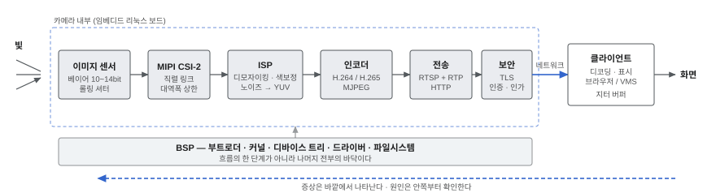

# IP카메라

IP카메라를 만들 때 지나가는 기술을 항목별로 정리한 노트다.
항목마다 손으로 확인할 수 있는 절차를 함께 적었고,
직접 부딪쳐 확인한 것만 **「실측」**이라고 표시했다.

웹에서 읽기: **<https://squid55.github.io/ipcam-notes/>**
블로그: **<https://squid55.github.io/>** — 날짜순 기록은 그쪽에 쓴다. 여기는 항목별로 고쳐 쌓는 노트다.



## 여기서 시작

무엇을 하려는지에 따라 들어가는 문이 다르다.

| 지금 막힌 것 | 먼저 볼 것 |
|---|---|
| 영상이 아예 안 나온다 | [MIPI CSI-2](docs/영상/MIPI-CSI2.md) · [V4L2](docs/영상/V4L2.md) — 인코더를 파기 전에 센서 입력부터 |
| 화질이 뭉갠다 | [MJPEG](docs/압축/MJPEG.md) · [H.264](docs/압축/H264.md) — 품질 인자가 아니라 비트레이트일 수 있다 |
| 지연이 크다 | [HLS · DASH](docs/네트워크/HLS-DASH.md) · [RTP](docs/네트워크/RTP.md) — 대개 수신 측 버퍼가 가장 큰 몫이다 |
| 카메라가 안 잡힌다 | [디바이스 트리](docs/BSP/디바이스트리.md) · [UART · I2C · SPI · GPIO](docs/BSP/버스.md) — 드라이버 아래 계층부터 |
| 보드가 안 뜬다 | [U-Boot](docs/BSP/U-Boot.md) · [커널 구조](docs/BSP/커널구조.md) · [플래시 · 파일시스템](docs/BSP/플래시와파일시스템.md) |
| 보안 요구를 맞춰야 한다 | [인증과 인가](docs/보안/인증과인가.md) · [TLS · X.509](docs/보안/TLS-X509.md) · [감사기록](docs/보안/감사기록.md) |
| 처음 시작한다 | [V4L2](docs/영상/V4L2.md) → [H.264](docs/압축/H264.md) → [RTSP](docs/네트워크/RTSP.md) 순서로 |

실제로 막혔던 지점만 모은 [함정 모음](docs/함정모음.md)도 있다.
문서에 없거나, 읽어도 알기 어려운 것들이다.

## 자주 틀리는 세 가지

여기 적힌 것은 모두 직접 부딪쳐 확인한 것이다.

- **영상이 안 나오면 인코더가 아니라 센서 입력부터 본다.**
  유효 프레임이 없으면 모든 스트림이 동시에 고장나는데, 코덱마다 증상이 달라 보인다.
  첫 시험은 언제나 `v4l2-ctl --stream-count=1` 이다. → [MIPI CSI-2](docs/영상/MIPI-CSI2.md)
- **MJPEG 화질은 JPEG 품질이 아니라 비트레이트 문제일 수 있다.**
  품질 파라미터를 아예 노출하지 않는 하드웨어가 있다.
  프레임당 바이트를 재보면 바로 갈린다. → [MJPEG](docs/압축/MJPEG.md)
- **데이터시트에 있어도 보드에는 없을 수 있다.**
  평가 보드는 일부 회로를 비워 둔다. 시각 · 보안 · 전원 기능에서 특히 자주 생긴다.
  → [회로도 읽기](docs/하드웨어/회로도읽기.md)

## 순서에 대해

번호는 난이도가 아니라 **의존 관계**다. 앞을 모르면 뒤가 겉돈다.

- 0·1 은 어디로 가든 바탕이 된다
- 2 → 3 → 4 는 영상이 흘러가는 순서 그대로다
- 5 는 4 위에 얹히고, 6 은 나머지 전부의 아래에 깔린다

관심 있는 곳부터 봐도 되지만, 막히면 대개 앞 단계에 답이 있다.

---

## 0. 공통 바탕

| 항목 | |
|---|---|
| [C / C++](docs/공통/C와Cpp.md) | 작성됨 |
| [객체지향(OOP) 설계](docs/공통/OOP설계.md) | 작성됨 |
| [자료구조 · 알고리즘](docs/공통/자료구조와알고리즘.md) | 작성됨 |
| [Linux 개발환경 · 셸](docs/공통/리눅스셸.md) | 작성됨 |
| [디버깅](docs/공통/디버깅.md) — gdb · 로그 · 이분 탐색 | 작성됨 |
| [소켓 · TCP / UDP](docs/공통/소켓.md) | 작성됨 |
| [Git](docs/공통/Git.md) | 작성됨 |

## 1. 리눅스가 하드웨어를 다루는 방식

| 항목 | |
|---|---|
| [프로세스 · 스레드 · 스케줄링](docs/리눅스/프로세스와스레드.md) | 작성됨 |
| [파일 디스크립터 · `ioctl` · `mmap`](docs/리눅스/fd-ioctl-mmap.md) | 작성됨 |
| [멀티스레드 프로그래밍](docs/리눅스/멀티스레드.md) | 작성됨 |
| [비동기 I/O](docs/리눅스/비동기IO.md) — `select` · `poll` · `epoll` | 작성됨 |
| [커널 공간 vs 유저 공간](docs/리눅스/커널과유저공간.md) | 작성됨 |

## 2. 영상이 만들어지는 경로

| 항목 | |
|---|---|
| [이미지 센서](docs/영상/이미지센서.md) — CMOS · 베이어 패턴 | 작성됨 |
| [MIPI CSI-2](docs/영상/MIPI-CSI2.md) — 센서와 SoC 를 잇는 경로 | 작성됨 |
| [V4L2](docs/영상/V4L2.md) — 리눅스가 카메라를 다루는 규격 | 작성됨 |
| [ISP 파이프라인](docs/영상/ISP.md) — 디모자이크 → 색보정 → 노이즈 | 작성됨 |
| 3A — AE / AWB / AF | [ISP 파이프라인](docs/영상/ISP.md) 안에 |
| [색공간](docs/영상/색공간.md) — YUV / NV12 / RGB | 작성됨 |

## 3. 압축

| 항목 | |
|---|---|
| 압축이 왜 필요한가 — 대역폭 계산 | [H.264](docs/압축/H264.md) 안에 |
| [H.264](docs/압축/H264.md) 구조 — NAL · SPS/PPS · I/P/B | 작성됨 |
| [H.265](docs/압축/H265.md) — H.264 와의 차이 | 작성됨 |
| [MJPEG](docs/압축/MJPEG.md) — 왜 아직 쓰이는가 | 작성됨 |
| 레이트 컨트롤 — CBR · VBR · 비트레이트와 화질 | [H.264](docs/압축/H264.md) 안에 |
| [하드웨어 인코더 vs 소프트웨어](docs/압축/하드웨어인코더.md) | 작성됨 |

## 4. 네트워크로 보내기

| 항목 | |
|---|---|
| [RTP · RTCP](docs/네트워크/RTP.md) | 작성됨 |
| [RTSP](docs/네트워크/RTSP.md) — 제어와 전송의 분리 | 작성됨 |
| RTSPS · SRTP — 어디를 암호화하는가 | [RTSP](docs/네트워크/RTSP.md) 안에 |
| HTTP / HTTPS · TLS 1.3 | [TLS · X.509](docs/보안/TLS-X509.md) |
| [HLS · DASH](docs/네트워크/HLS-DASH.md) — 왜 지연이 큰가 | 작성됨 |
| [WebRTC](docs/네트워크/WebRTC.md) — 왜 빠르고 왜 무거운가 | 작성됨 |
| [ONVIF](docs/네트워크/ONVIF.md) — 업계 표준 연동 | 작성됨 |
| [REST API · WebSocket](docs/네트워크/REST와WebSocket.md) | 작성됨 |

## 5. 보안

| 항목 | |
|---|---|
| [인증과 인가](docs/보안/인증과인가.md) | 작성됨 |
| 비밀번호 저장 — 해시 · PBKDF2 · 솔트 | [인증과 인가](docs/보안/인증과인가.md) 안에 |
| 세션 관리 · 토큰 | [인증과 인가](docs/보안/인증과인가.md) 안에 |
| [TLS · X.509](docs/보안/TLS-X509.md) | 작성됨 |
| [감사기록 · 해시 체인](docs/보안/감사기록.md) | 작성됨 |
| [무결성 검증 · 서명 업데이트](docs/보안/무결성과서명업데이트.md) | 작성됨 |

## 6. 보드를 띄우는 일 (BSP)

| 항목 | |
|---|---|
| 부팅 순서 — ROM → 부트로더 → 커널 → init | [U-Boot](docs/BSP/U-Boot.md) 안에 |
| [U-Boot](docs/BSP/U-Boot.md) — 진입 · 환경변수 · 플래시 | 작성됨 |
| [디바이스 트리](docs/BSP/디바이스트리.md) | 작성됨 |
| [커널 구조 · 모듈](docs/BSP/커널구조.md) | 작성됨 |
| [디바이스 드라이버 작성](docs/BSP/디바이스드라이버.md) | 작성됨 |
| [플래시 · 파일시스템](docs/BSP/플래시와파일시스템.md) — MTD · UBI · UBIFS | 작성됨 |
| [UART · I2C · SPI · GPIO](docs/BSP/버스.md) | 작성됨 |
| [크로스 컴파일](docs/BSP/크로스컴파일.md) · 툴체인 · 정적 링크 | 작성됨 |
| [Buildroot](docs/BSP/Buildroot와Yocto.md) | 작성됨 |
| [Yocto](docs/BSP/Buildroot와Yocto.md) | 같은 페이지에서 비교 |

## 7. 관제 쪽 (VMS)

| 항목 | |
|---|---|
| [Modern C++](docs/관제/ModernCpp.md) — C++11 이상 | 작성됨 |
| [Qt · QML](docs/관제/Qt-QML.md) | 작성됨 |
| [FFmpeg](docs/관제/FFmpeg.md) | 작성됨 |
| [OpenCV](docs/관제/OpenCV.md) | 작성됨 |
| [Video Analytics](docs/관제/VideoAnalytics.md) — 검출 · 추적 · 규칙 판정 | 작성됨 |

## 8. 하드웨어

회로를 직접 설계하지 않더라도, 회로도를 읽을 수 있으면 문제의 절반이 빨리 갈린다.

| 항목 | |
|---|---|
| [회로도 읽기](docs/하드웨어/회로도읽기.md) — 부품 미실장 표기 | 작성됨 |
| [전원 · 레귤레이터](docs/하드웨어/전원.md) · 차지펌프 | 작성됨 |
| [PTZ 모터 구동](docs/하드웨어/PTZ.md) | 작성됨 |
| [오실로스코프 · 로직 애널라이저](docs/하드웨어/계측.md) | 작성됨 |

---

## 분야를 가로지르는 것

| 문서 | |
|---|---|
| [함정 모음](docs/함정모음.md) | 실제로 막혔던 지점 25건 |

---

## 웹으로 보기

마크다운을 위키 스타일 정적 사이트로 변환하는 도구가 `tools/` 에 있다.
의존성이 없어서 `python3` 만 있으면 어디서나 돌아간다.

```bash
make serve      # 생성하고 http://127.0.0.1:8000/ 로 미리보기
make check      # 생성 결과 검사 (링크 · 코드 블록 · 표 · 본문 유실)
make site       # site/ 에 생성만
```

`main` 에 푸시하면 GitHub Actions 가 같은 절차로 빌드해 Pages 에 올린다.
Pages 를 처음 켤 때는 저장소 Settings → Pages → Source 를
**GitHub Actions** 로 한 번 바꿔야 한다.

변환기가 하는 일 중 원본에 없는 것이 셋 있다.

| 마크다운 | 사이트 |
|---|---|
| `⚠` 로 시작하는 문단 | 주의 상자 |
| `실측:` 을 포함하는 문단 | 실측 상자 |
| 「흔한 오해」 절의 소제목 | 오해 상자 (앵커와 목차는 유지) |

앵커는 GitHub 규약(소문자화)과 맞췄다. 같은 링크가 GitHub 에서도,
사이트에서도 동작한다.

## 페이지 형식

[템플릿](docs/_템플릿.md) 참고. 여섯 부분으로 쓴다.

```
한 줄 정의 → 왜 필요한가 → 최소 이해 수준 → 직접 해보기 → 더 들어가면 → 참고
```

읽은 내용과 직접 확인한 내용은 구분해서 적는다. 「실측」이라고 쓴 것만 직접 확인한 것이다.
