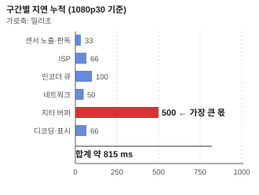

# HLS · DASH — 왜 지연이 큰가

> 영상을 몇 초짜리 파일 조각으로 잘라 HTTP 로 내려주는 방식.
> 전용 프로토콜을 쓰지 않는 것이 장점이고, 지연이 큰 것이 단점이다.

## 왜 필요한가

RTSP 는 방화벽을 잘 통과하지 못하고, 브라우저가 직접 재생하지 못한다.
HLS·DASH 는 **그냥 HTTP 파일 다운로드**라서 어디서나 통한다 —
CDN·프록시·방화벽이 전부 이미 HTTP 를 다룰 수 있다.

감시 카메라에서는 실시간 관제보다 **원격 앱 시청 · 외부 공개 · 녹화 다시보기**에 쓰인다.
실시간 관제에는 지연 때문에 맞지 않는다.

## 최소 이해 수준



- **구조는 둘 다 같다.** 재생목록 파일 + 조각 파일들.
  클라이언트가 재생목록을 주기적으로 다시 받아 새 조각을 찾아 내려받는다.
- **HLS** — 애플이 만들었고 `.m3u8` 텍스트 재생목록을 쓴다. RFC 8216.
- **DASH** — MPEG 표준이고 `.mpd` XML 재생목록을 쓴다. ISO/IEC 23009-1.
  코덱에 중립적으로 설계됐다.
- **재생목록 예시.**
  ```
  #EXTM3U
  #EXT-X-VERSION:3
  #EXT-X-TARGETDURATION:4
  #EXT-X-MEDIA-SEQUENCE:127
  #EXTINF:4.000,
  seg127.ts
  #EXTINF:4.000,
  seg128.ts
  ```
- **지연의 원인은 구조 자체다.**
  ```
  조각 길이 × 버퍼링할 조각 수 + 재생목록 갱신 주기
  ```
  4초 조각 3개를 모아야 재생을 시작하는 관행이면 **최소 12초**다.
  거기에 인코딩·업로드·네트워크가 더해진다.
- **조각은 키프레임에서 시작해야 한다.** 그래야 그 조각만으로 디코딩이 시작된다.
  그래서 **GOP 길이가 조각 길이를 제약한다.** 4초 조각을 만들려면
  키프레임 간격이 4초(또는 그 약수)여야 한다. → [H.264](../압축/H264.md)
- **적응 비트레이트(ABR)가 본래 목적이다.** 같은 영상을 여러 화질로 준비해 두고
  클라이언트가 회선 상태를 보고 골라 받는다. 감시 카메라 한 대에서는 잘 안 쓴다.
- **컨테이너.** HLS 는 전통적으로 MPEG-TS(`.ts`), 최근에는 fMP4(`.m4s`)도 쓴다.
  DASH 는 fMP4 가 기본이다. **fMP4 를 쓰면 두 방식이 같은 조각을 공유**할 수 있다.

## 직접 해보기

### 1. 재생목록 받아 보기

```bash
curl -s 'http://<주소>/hls/stream.m3u8'
```

`#EXT-X-TARGETDURATION` 이 조각 길이, 목록의 조각 개수가 창(window) 크기다.
**이 두 숫자로 지연의 하한이 계산된다.**

### 2. 지연을 직접 재기

```
① 화면에 초 단위 시계를 띄운다 (스마트폰 스톱워치도 된다)
② 카메라로 그 화면을 찍는다
③ 재생 화면과 실제 시계를 한 컷에 넣고 사진을 찍는다
④ 두 숫자의 차이가 전체 지연이다
```

**이것이 가장 정확한 방법이다.** 로그의 타임스탬프로 계산한 값은
버퍼링을 반영하지 않는다.

### 3. 조각 하나를 꺼내 보기

```bash
curl -s -O 'http://<주소>/hls/seg127.ts'
ffprobe -v error -show_frames -select_streams v -read_intervals '%+#3' seg127.ts \
  | grep -E 'key_frame|pict_type'
```

첫 프레임이 `key_frame=1` · `pict_type=I` 여야 한다.
아니면 그 조각부터 재생을 시작할 수 없다.

### 4. 재생목록이 갱신되는 주기 확인

```bash
for i in $(seq 1 10); do
  printf '%s ' "$(date +%T)"
  curl -s 'http://<주소>/hls/stream.m3u8' | grep -c '\.ts$'
  sleep 1
done
```

조각 수가 언제 늘어나는지 보면 실제 갱신 주기가 나온다.

### 5. 직접 만들어 보기

```bash
ffmpeg -i rtsp://<주소>/stream -c:v copy -f hls \
  -hls_time 2 -hls_list_size 5 -hls_flags delete_segments \
  /var/www/hls/stream.m3u8
```

`-c:v copy` 로 재인코딩을 피하는 것이 중요하다.
다만 그러면 **GOP 길이를 못 바꾸므로** `-hls_time` 이 원본 GOP 에 맞아야 한다.

### 6. 저지연 설정 시도

```bash
ffmpeg -i rtsp://<주소>/stream -c:v copy -f hls \
  -hls_time 1 -hls_list_size 3 -hls_flags delete_segments+independent_segments \
  /var/www/hls/stream.m3u8
```

지연은 줄지만 요청 빈도가 3배가 되고, 조각이 짧아져 압축 효율이 떨어진다.
**맞바꿈이 분명히 드러나는 지점이다.**

## 더 들어가면

- **LL-HLS (저지연 HLS).** 조각을 더 잘게 쪼갠 「부분 조각」을 미리 알려주고,
  HTTP/2 푸시나 블로킹 요청으로 즉시 받는다. 2초 아래까지 내려가지만
  서버 구현이 복잡해진다.
- **CMAF.** HLS 와 DASH 가 같은 fMP4 조각을 쓰게 하는 규격.
  두 방식을 동시에 서비스할 때 저장 공간이 절반이 된다.
- **`#EXT-X-PLAYLIST-TYPE`.** 라이브(생략 또는 `EVENT`)와 녹화(`VOD`)의 구분.
  `VOD` 면 클라이언트가 전체 길이를 알고 탐색할 수 있다.
- **DVR 창.** 재생목록에 조각을 오래 남겨 두면 지난 구간으로 되돌릴 수 있다.
  디스크 용량과 맞바꾼다.
- **암호화.** HLS 는 `#EXT-X-KEY` 로 AES-128 조각 암호화를 지원한다.
  키는 별도 URL 로 받고, 그 URL 을 HTTPS + 인증으로 보호해야 의미가 있다.
  → [TLS · X.509](../보안/TLS-X509.md)

## 흔한 오해

### 「조각을 짧게 하면 지연이 사라진다」

줄지만 없어지지 않는다. 그리고 대가가 있다 —
조각마다 키프레임이 필요하므로 **키프레임 빈도가 올라가 비트레이트가 늘고**,
HTTP 요청 수가 늘고, 파일이 많아져 서버 부하가 커진다.

1초 아래로 내려가려면 LL-HLS 같은 별도 메커니즘이 필요하다.
**구조적으로 RTSP·WebRTC 를 따라잡을 수 없다.** → [WebRTC](WebRTC.md)

### 「HLS 는 스트리밍 프로토콜이다」

프로토콜이라기보다 **HTTP 위의 관례**다. 서버는 그냥 파일을 내려주고,
「지금 무엇을 받을지」는 전부 클라이언트가 결정한다.
그래서 서버가 상태를 갖지 않고 CDN 으로 쉽게 퍼진다.

### 「브라우저가 HLS 를 기본 지원한다」

사파리는 한다. 다른 브라우저는 `MediaSource` 위에서 동작하는
자바스크립트 라이브러리(hls.js 등)가 필요하다.
**H.265 를 쓰면 여기서 또 막힌다.** → [H.265](../압축/H265.md)

### 「실시간 관제에도 쓸 수 있다」

PTZ 조작이나 사고 대응처럼 **반응이 필요한 용도에는 맞지 않는다.**
10초 전 화면을 보고 카메라를 돌리면 계속 목표를 놓친다.
관제는 RTSP 나 WebRTC, 다시보기와 공개 시청은 HLS 로 나누는 것이 보통이다.

### 「조각 파일만 지우면 정리된다」

재생목록에서 먼저 빼고 지워야 한다. 순서가 반대면 클라이언트가
목록에 있는 파일을 받으러 가서 404 를 맞는다. `delete_segments` 는 이 순서를 지킨다.

## 참고

- **RFC 8216** — HLS
- **ISO/IEC 23009-1** — MPEG-DASH
- **Apple: Low-Latency HLS** — LL-HLS 규격 설명
- 관련 항목: [RTSP](RTSP.md) · [WebRTC](WebRTC.md) · [H.264](../압축/H264.md)
