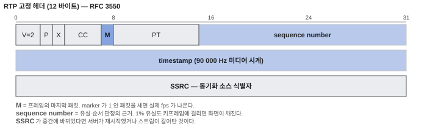

# RTP · RTCP

> RTP 는 실시간 미디어를 실어 나르는 패킷 형식이고,
> RTCP 는 그 전송이 잘 되고 있는지 서로 알려주는 보조 채널이다.

## 왜 필요한가

RTSP 는 「재생해 달라」는 요청만 보낸다. **실제 영상 바이트는 RTP 로 흐른다.**
그래서 「연결은 되는데 화면이 안 나온다」의 절반은 RTP 단계 문제다.

그리고 RTP 헤더에는 문제 해결에 필요한 정보가 다 들어 있다 —
순번, 타임스탬프, 스트림 식별자. 캡처 한 번이면 유실인지, 순서 뒤바뀜인지,
아예 안 오는 것인지 구분된다.

## 최소 이해 수준



- **RTP 는 보통 UDP 위에 있다.** 재전송하지 않는다. 늦게 도착한 프레임은
  쓸모가 없기 때문에 **다시 보내는 것보다 버리는 것이 낫다**는 판단이다.
- **헤더 12바이트만 알면 된다.**

  | 필드 | 크기 | 쓰임 |
  |---|---|---|
  | version | 2bit | 항상 2 |
  | M (marker) | 1bit | 영상에서는 「프레임의 마지막 패킷」 표시 |
  | PT (payload type) | 7bit | 무엇이 실렸는지 (동적 96~127 이 흔함) |
  | sequence number | 16bit | 1씩 증가. **유실·순서 판정의 근거** |
  | timestamp | 32bit | 미디어 시계 기준 시각. 같은 프레임이면 같은 값 |
  | SSRC | 32bit | 스트림 식별자. 송신자가 바뀌면 값이 바뀐다 |

- **타임스탬프는 벽시계가 아니다.** 영상은 보통 90000Hz 클럭을 쓴다.
  30fps 면 프레임마다 `90000/30 = 3000` 씩 는다. 이 값으로 영상·음성을 맞춘다.
- **한 프레임이 여러 패킷으로 쪼개진다.** MTU 때문에 한 패킷은 1400바이트쯤이다.
  키프레임 하나가 수십 개 패킷이 되고, **그중 하나만 잃어도 프레임 전체가 못 쓴다.**
- **포트는 짝수/홀수 쌍.** RTP 가 짝수 포트, RTCP 가 그다음 홀수 포트를 쓴다.
- **RTCP 가 품질을 알려준다.**
  수신자 보고(RR)에 유실률 · 지터 · 왕복시간이 들어 있다.
  송신자 보고(SR)에는 RTP 타임스탬프와 실제 시각(NTP)의 대응이 들어 있어
  **여러 스트림을 같은 시간축에 맞출 수 있다.**
- **RTP 자체에는 보안이 없다.** 암호화하려면 SRTP 를 쓴다.
  키는 보통 RTSP 쪽에서 협상한다. → [RTSP](RTSP.md)

## 직접 해보기

### 1. RTP 패킷 캡처해서 헤더 읽기

```bash
sudo tcpdump -i any -n udp portrange 5000-65535 -w /tmp/rtp.pcap
```

```bash
tshark -r /tmp/rtp.pcap -d udp.port==0,rtp \
  -T fields -e rtp.seq -e rtp.timestamp -e rtp.marker -e rtp.ssrc | head -20
```

`-d udp.port==0,rtp` 로 강제 해석하지 않으면 그냥 `UDP` 로만 보인다.
**RTSP 세션 전체를 캡처했다면 자동으로 잡힌다.**

### 2. 유실률 계산

```bash
tshark -r /tmp/rtp.pcap -d udp.port==0,rtp -T fields -e rtp.seq \
  | awk 'NR==1{p=$1;n=0;g=0;next} {d=$1-p; if(d>1) g+=d-1; if(d<0) print "역순:",p,"->",$1; p=$1; n++}
         END{printf "받은 %d, 빠진 %d, 유실률 %.2f%%\n", n, g, 100*g/(n+g)}'
```

**1% 만 잃어도 키프레임이 걸리면 화면이 눈에 띄게 깨진다.**

### 3. 프레임 경계 세기

marker 비트가 1인 패킷이 프레임의 끝이다.

```bash
tshark -r /tmp/rtp.pcap -d udp.port==0,rtp -T fields -e rtp.marker \
  | grep -c '^1$'
```

캡처 시간으로 나누면 실제 fps 다. 설정한 fps 와 다르면 인코더가 못 따라가는 것이다.

### 4. 지터 보기

```bash
tshark -r /tmp/rtp.pcap -d udp.port==0,rtp -q -z rtp,streams
```

스트림별로 유실 · 최대 지터 · 평균 지터가 한 번에 나온다. 가장 빠른 진단이다.

### 5. UDP 가 막혔는지 확인

```bash
# TCP 인터리브로 받아지면 UDP 경로만 막힌 것이다
ffplay -rtsp_transport tcp  rtsp://<주소>/stream
ffplay -rtsp_transport udp  rtsp://<주소>/stream
```

TCP 는 되고 UDP 는 안 되면 방화벽이나 NAT 문제다. 코덱 문제가 아니다.

## 더 들어가면

- **페이로드 형식은 코덱마다 다르다.**
  H.264 는 RFC 6184, H.265 는 RFC 7798, JPEG 은 RFC 2435.
  「어떻게 쪼개고 다시 붙이는가」가 여기 정의돼 있다.
  H.264 의 FU-A 조각화, STAP-A 묶음 같은 것이 그것이다.
- **SRTP (RFC 3711).** 페이로드를 암호화하고 인증 태그를 붙인다.
  **헤더는 암호화하지 않는다** — 중간 장비가 순번을 봐야 하기 때문이다.
- **지터 버퍼.** 도착 간격의 흔들림을 흡수하려고 수신 측이 잠시 모아 둔다.
  크게 잡으면 안정적이지만 지연이 늘고, 작게 잡으면 반대다.
  **저지연 감시와 안정 재생의 맞바꿈이 여기서 일어난다.**
- **RTCP 주기.** 전체 대역폭의 5% 정도를 넘지 않게 자동 조절된다.
  시청자가 많으면 보고 간격이 저절로 길어진다.
- **RTP 를 안 쓰는 길.** WebRTC 는 내부적으로 RTP/SRTP 를 쓰지만
  HLS·DASH 는 HTTP 로 파일 조각을 받는 완전히 다른 방식이다.

## 흔한 오해

### 「UDP 라서 불안정하다」

목적이 다르다. 실시간 영상에서 3초 늦게 도착한 프레임은 이미 쓸모가 없다.
TCP 는 그것을 기어이 재전송하느라 **뒤의 모든 프레임을 막는다**(head-of-line blocking).
지연이 중요한 곳에서는 UDP 가 옳은 선택이다.

### 「순번이 안 빠졌으면 정상이다」

순서가 뒤바뀌어 도착할 수 있다. 순번만 세면 유실이 0 으로 보이지만
수신기가 재정렬을 못 하면 화면은 깨진다. **도착 순서와 순번을 함께** 봐야 한다.

### 「RTP 타임스탬프로 지연을 잴 수 있다」

RTP 타임스탬프는 미디어 시계이고 시작값이 무작위다. 벽시계와 대응시키려면
**RTCP 송신자 보고(SR)** 가 필요하다. SR 없이 계산한 지연은 의미가 없다.

### 「RTCP 는 없어도 된다」

영상은 나온다. 하지만 유실률도 모르고, 여러 스트림 동기도 안 되고,
NAT 매핑 유지도 안 된다. **문제가 생겼을 때 볼 것이 없다.**

### 「SSRC 는 고정이다」

충돌이 감지되거나 송신자가 재시작하면 바뀐다. SSRC 가 바뀌면
수신기는 새 스트림으로 보고 지터 버퍼를 비운다. 캡처에서 SSRC 가 중간에
달라졌다면 **서버가 재시작했거나 스트림이 갈아탄 것**이다.

## 참고

- **RFC 3550** — RTP · RTCP 본체
- **RFC 6184** — H.264 페이로드 형식 (FU-A · STAP-A)
- **RFC 3711** — SRTP
- 관련 항목: [RTSP](RTSP.md) · [H.264](../압축/H264.md) · [MJPEG](../압축/MJPEG.md)
