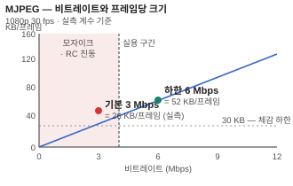

# MJPEG (Motion JPEG)

> 프레임마다 독립적인 JPEG 을 만들어 연달아 보내는 방식.
> 프레임 사이의 관계를 쓰지 않는다.

## 왜 필요한가

가장 단순한 영상 전송 방법이다. 브라우저가 `` 태그 하나로 받을 수 있어서
**웹 미리보기 화면에 압도적으로 많이 쓰인다.** 플러그인도 자바스크립트 디코더도 필요 없다.

그리고 디버깅에 좋다. 프레임 하나를 잘라내면 그대로 열리는 JPEG 이다.
H.264 스트림은 그렇게 못 한다.

## 최소 이해 수준

- **프레임 간 예측이 없다.** 모든 프레임이 H.264 의 I 프레임에 해당한다.
  그래서 같은 화질이면 **비트레이트가 H.264 의 5~20배**다.
- **HTTP 로 보내는 방법: multipart.**
  ```
  Content-Type: multipart/x-mixed-replace; boundary=FRAME

  --FRAME
  Content-Type: image/jpeg
  Content-Length: 24816

  <JPEG 바이트>
  --FRAME
  Content-Type: image/jpeg
  ...
  ```
  연결을 끊지 않고 계속 흘려보낸다. 브라우저는 새 파트가 올 때마다 이미지를 교체한다.
- **`Content-Length` 를 넣는다.** 없어도 경계 문자열로 구분되지만,
  넣으면 클라이언트가 파싱을 훨씬 안정적으로 한다.
- **지연이 매우 낮다.** 프레임 하나가 곧 완결된 이미지라 버퍼링할 이유가 없다.
  B 프레임도 없다. 실시간 관제 화면에서 이 점이 크다.
- **손실에 강하다.** 한 프레임이 깨져도 다음 프레임이 온전하다.
  H.264 는 참조 프레임이 깨지면 그 뒤가 다 무너진다.
- **음성이 없다.** 컨테이너가 아니라 이미지 나열이므로 오디오를 실을 자리가 없다.

## 직접 해보기

### 1. 스트림이 정말 MJPEG 인지 확인

```bash
curl -sI 'http://<주소>/stream' | grep -i content-type
```

`multipart/x-mixed-replace` 가 보여야 한다.

### 2. 프레임 크기와 실제 비트레이트 재기

```bash
# 10초 받아서 크기 보기
timeout 10 curl -s 'http://<주소>/stream' -o /tmp/mjpeg.bin
ls -l /tmp/mjpeg.bin

# 프레임 개수 = JPEG 시작 마커(FFD8) 개수
grep -c $'\xff\xd8\xff' /tmp/mjpeg.bin
```

`파일크기 ÷ 10초 × 8` 이 bps 다.
`파일크기 ÷ 프레임수` 가 프레임 하나의 평균 바이트다.

**프레임 평균이 30KB 아래로 내려가면 1080p 에서는 눈에 띄게 뭉갠다.**

### 3. 프레임 하나를 꺼내 열어 보기

```bash
python3 - <<'EOF'
d = open('/tmp/mjpeg.bin','rb').read()
s = d.find(b'\xff\xd8\xff'); e = d.find(b'\xff\xd9', s) + 2
open('/tmp/one.jpg','wb').write(d[s:e])
print('프레임 크기', e-s)
EOF
```

`/tmp/one.jpg` 가 그냥 열리면 스트림 형식을 제대로 이해한 것이다.

### 4. JPEG 품질 인자 확인

```bash
identify -verbose /tmp/one.jpg | grep -iE 'quality|geometry'
```

품질이 높은데도 화면이 뭉개져 보이면 **품질이 원인이 아니다.** 아래 오해 절을 본다.

### 5. 스트림이 끊겼는지 확인

```bash
# 마지막 바이트가 들어온 뒤 얼마나 지났는지
timeout 30 curl -s 'http://<주소>/stream' | \
  stdbuf -o0 tr -c '' '' | pv -btr > /dev/null
```

`pv` 의 속도 표시가 0 으로 떨어지면 서버가 더 안 보내는 것이다.

## 더 들어가면

- **RTP 로도 보낼 수 있다.** RFC 2435 가 RTP 페이로드 형식을 정의한다.
  다만 실무에서 MJPEG 은 거의 HTTP 로 나간다. → [RTP · RTCP](../네트워크/RTP.md)
- **Motion JPEG 2000** — 방송 · 아카이브 쪽에서 쓰는 다른 규격이다. 별개다.
- **부분 갱신 없음.** 화면 구석 시계만 움직여도 전체 프레임을 다시 보낸다.
  고정 화면일수록 H.264 대비 손해가 커진다.
- **다중 시청자 비용.** 인코딩을 한 번 하고 여러 명에게 같은 바이트를 뿌릴 수 있다면
  CPU 는 늘지 않고 대역폭만 는다. 시청자마다 인코더를 새로 띄우는 구현이라면
  **CPU 가 시청자 수에 비례**한다. 어느 쪽인지 확인해야 한다.

## 흔한 오해

### 「MJPEG 화질이 나쁘면 JPEG 품질을 올리면 된다」

품질 인자를 올려도 안 바뀌는 경우가 있다.



실측: 어떤 SoC 는 JPEG 품질 파라미터를 아예 노출하지 않고, MJPEG 출력이
**H.264 용 비트레이트 제어기에 묶여** 있었다. 기본 비트레이트로 나눠 가지다 보니
프레임당 26KB 밖에 안 나왔고 그래서 모자이크처럼 보였다.
고친 방법은 품질이 아니라 **비트레이트 상향**이었다.

증상이 「전체적으로 블록이 크게 뭉친다」면 품질보다 비트레이트를 먼저 의심한다.
프레임당 바이트를 재보면 바로 구분된다.

### 「비트레이트를 낮출수록 좋다」

너무 낮추면 제어기가 진동한다. 실측: 어떤 하한 아래로 내리면 프레임 크기가
크게 출렁이면서 화질이 프레임마다 널뛰었다. **안정적으로 동작하는 하한**이 따로 있다.

### 「스트림이 끊기면 화면에 표시된다」

가장 위험한 오해다. 서버가 연결을 깨끗하게 닫으면 브라우저의 `` 는
`onerror` 를 내지 않는다. **마지막 프레임이 그대로 멈춰 있고**, 보는 사람은
정지 화면인지 조용한 장면인지 구분할 수 없다.

실측으로 확인된 문제였다. 해결은 프레임 도착 간격을 재는 감시 타이머를 두고,
일정 시간 새 프레임이 없으면 화면에 「끊김」을 명시하는 것이다.

```js
let last = Date.now();
img.addEventListener('load', () => { last = Date.now(); });
setInterval(() => {
  if (Date.now() - last > GAP_MS) 화면에_끊김_표시();
}, 1000);
```

### 「브라우저가 새로고침하면 최신 화면이 나온다」

캐시 헤더가 없으면 브라우저가 옛 스크립트나 옛 이미지를 계속 쓴다.
실측: `Cache-Control` 이 없어서 며칠 지난 자바스크립트가 쓰이고 있었고,
서버 쪽 파일은 이미 새것이었다. **서버에서 해시를 대조해 보기 전까지**
원인을 잘못 짚기 쉽다.

### 「낮은 지연이 필요하면 무조건 MJPEG」

지연은 낮지만 대역폭이 크다. 회선이 좁으면 큐가 쌓여 **오히려 지연이 커진다.**
좁은 회선에서는 H.264 저지연 설정이 나을 수 있다.

## 참고

- **ITU-T T.81 / ISO 10918** — JPEG 규격 자체
- **RFC 2435** — RTP 위의 JPEG
- **RFC 2046** — multipart 형식
- 관련 항목: [H.264](H264.md) · [색공간](../영상/색공간.md) · [함정 모음](../함정모음.md)
