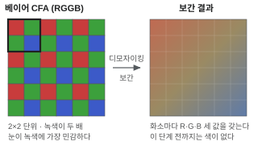

# 이미지 센서 · 베이어 패턴

> 빛을 전기 신호로 바꾸는 부품. 카메라 화질의 상한선은 여기서 정해진다.

## 왜 필요한가

센서에서 나오는 데이터는 아직 사진이 아니다. **색이 없는 격자 무늬 숫자 배열**이다.
이것을 모르면 「왜 캡처한 파일을 열면 흑백 체크무늬가 보이는가」에서 막힌다.

그리고 센서 선택이 나머지 전부를 결정한다. 해상도 · 프레임레이트 · 저조도 성능 ·
필요한 대역폭 · 심지어 커널에 드라이버가 있는지까지.

## 최소 이해 수준



- **화소는 색을 모른다.** 포토다이오드는 빛의 세기만 잰다. 색을 얻으려면
  화소마다 다른 색 필터를 씌운다.
- **베이어 패턴(Bayer CFA).** 2×2 를 단위로 `R G / G B` 를 반복한다.
  녹색이 두 배인 이유는 사람 눈이 녹색 대역에 가장 민감하기 때문이다.
  시작 위치에 따라 `RGGB` · `BGGR` · `GRBG` · `GBRG` 네 가지가 있고,
  **틀리면 빨강과 파랑이 뒤바뀐다.**
- **디모자이킹(demosaic).** 각 화소의 빠진 두 색을 이웃에서 추정해 채우는 계산.
  이 단계를 거쳐야 RGB 가 된다. → [ISP 파이프라인](ISP.md)
- **비트 깊이.** 센서는 보통 10 · 12 · 14비트로 낸다.
  8비트로 줄이기 전에 처리해야 어두운 부분이 뭉치지 않는다.
- **롤링 셔터 vs 글로벌 셔터.**
  롤링은 줄 단위로 순차 노출해서 빠른 물체가 기울어진다.
  글로벌은 전체를 동시에 노출한다. 비싸다. 감시 카메라는 대부분 롤링이다.
- **화소 크기가 저조도를 결정한다.**
  같은 해상도라면 센서가 클수록 화소가 크고, 화소가 클수록 빛을 많이 받는다.
  **화소 수를 늘리는 것과 어두운 데서 잘 보는 것은 상충한다.**
- **비닝(binning).** 이웃 화소를 묶어 하나로 읽는다. 해상도를 절반 내주고
  감도와 프레임레이트를 얻는다. 야간 모드에서 흔히 쓴다.

## 직접 해보기

### 1. 어떤 센서가 붙어 있는지 확인

```bash
# 커널이 인식한 센서 서브디바이스
ls /sys/class/video4linux/
dmesg | grep -iE 'imx|ov[0-9]{4}|sensor|camera'
```

`imx477` · `ov5647` 같은 이름이 보이면 드라이버가 붙은 것이다.
아무것도 없으면 디바이스트리에 센서 노드가 없거나 I2C 통신이 실패한 것이다.

### 2. I2C 로 센서가 살아 있는지 확인

```bash
i2cdetect -y -r 1
```

센서 주소(흔히 `0x10`·`0x1a`·`0x36`)에 값이 뜨면 전원과 클럭이 들어간 것이다.
안 뜨면 드라이버 문제가 아니라 **하드웨어 문제**다. → [I2C·SPI·GPIO](../BSP/버스.md)

### 3. 원시(RAW) 프레임을 받아 보기

```bash
v4l2-ctl -d /dev/video0 --list-formats-ext | grep -iE 'RG10|BG10|SRGGB|SBGGR'
v4l2-ctl -d /dev/video0 --set-fmt-video=width=1920,height=1080,pixelformat=RG10 \
         --stream-mmap --stream-count=1 --stream-to=raw.bin
ls -l raw.bin
```

`1920 × 1080 × 2` = 4,147,200 바이트가 나오면 10비트를 16비트 컨테이너에 담은 것이다.

### 4. 베이어 순서를 확인하는 방법

빨간 물체를 찍고 디모자이킹한다. 파랗게 나오면 패턴 순서가 반대다.
`RGGB` ↔ `BGGR` 을 바꿔 다시 해본다.

```bash
ffmpeg -f rawvideo -pix_fmt bayer_rggb16le -s 1920x1080 -i raw.bin -frames 1 rggb.png
ffmpeg -f rawvideo -pix_fmt bayer_bggr16le -s 1920x1080 -i raw.bin -frames 1 bggr.png
```

둘을 눈으로 비교하는 것이 가장 빠르다.

### 5. 노출과 게인을 직접 만져 보기

```bash
v4l2-ctl -d /dev/video0 --list-ctrls | grep -iE 'exposure|gain'
v4l2-ctl -d /dev/video0 --set-ctrl=exposure=200
v4l2-ctl -d /dev/video0 --set-ctrl=gain=64
```

노출을 올리면 밝아지지만 **프레임레이트가 떨어진다** — 한 프레임을 오래 노출하기 때문이다.
게인을 올리면 프레임레이트는 유지되지만 노이즈가 는다. 이 맞바꿈이 야간 화질의 전부다.

## 더 들어가면

- **MIPI CSI-2** — 센서와 SoC 를 잇는 고속 직렬 인터페이스.
  레인 수 × 레인당 속도가 대역폭 상한이고, 그것이 「최대 해상도 × 프레임레이트」를 정한다.
- **HDR / WDR** — 노출이 다른 두세 장을 합쳐 밝은 곳과 어두운 곳을 같이 살린다.
  움직이는 물체에 겹침(고스트)이 생긴다. 역광 출입구에서 중요하다.
- **IR 컷 필터 · 데이나이트.** 낮에는 적외선을 막고 밤에는 걷어낸다.
  걷어내면 색이 무너지므로 흑백으로 전환한다. 물리적으로 움직이는 부품이다.
- **셔터 속도 · 조리개 · 게인** — 노출 삼각형. 감시 카메라는 조리개가 고정인 경우가 많아
  실질적으로 셔터와 게인 둘만 남는다.
- **결함 화소 보정(DPC)** — 죽은 화소는 공정상 늘 있다. ISP 가 이웃 값으로 메운다.

## 흔한 오해

### 「화소 수가 많으면 화질이 좋다」

밝은 곳에서만 그렇다. 같은 센서 크기에서 화소를 늘리면 화소 하나가 작아져
저조도에서 불리하다. 감시 카메라는 야간 성능이 더 중요한 경우가 많다.

### 「RAW 는 압축 전 영상이다」

RAW 는 **디모자이킹 전**이다. 색이 아직 없다. 압축 여부와는 다른 축이다.

### 「센서를 바꾸면 해상도만 달라진다」

드라이버 · 디바이스트리 · ISP 튜닝이 전부 딸려 온다.
커널에 드라이버가 없는 센서를 고르면 그것부터 써야 한다.
**부품 선택 단계에서 「메인라인 커널에 드라이버가 있는가」를 먼저 본다.**

### 「센서가 30fps 를 지원하니 30fps 가 나온다」

해상도 · 비트 깊이 · 레인 수의 조합마다 상한이 다르다.
`--list-formats-ext` 가 실제로 낼 수 있는 조합을 알려준다.

## 참고

- 센서 데이터시트 — 레지스터 표와 지원 모드 목록이 1차 출처다
- **Linux Media subsystem** — `Documentation/userspace-api/media/`
- 관련 항목: [V4L2](V4L2.md) · [색공간](색공간.md) · [ISP 파이프라인](ISP.md)
